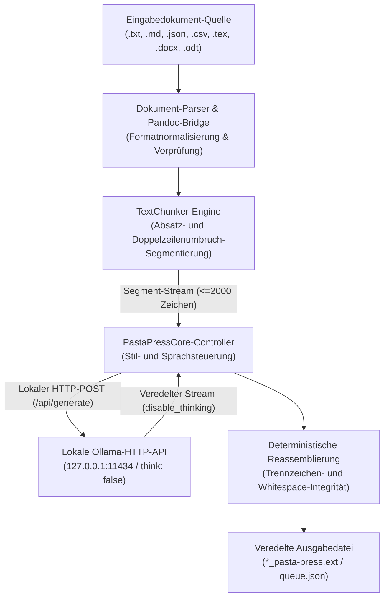
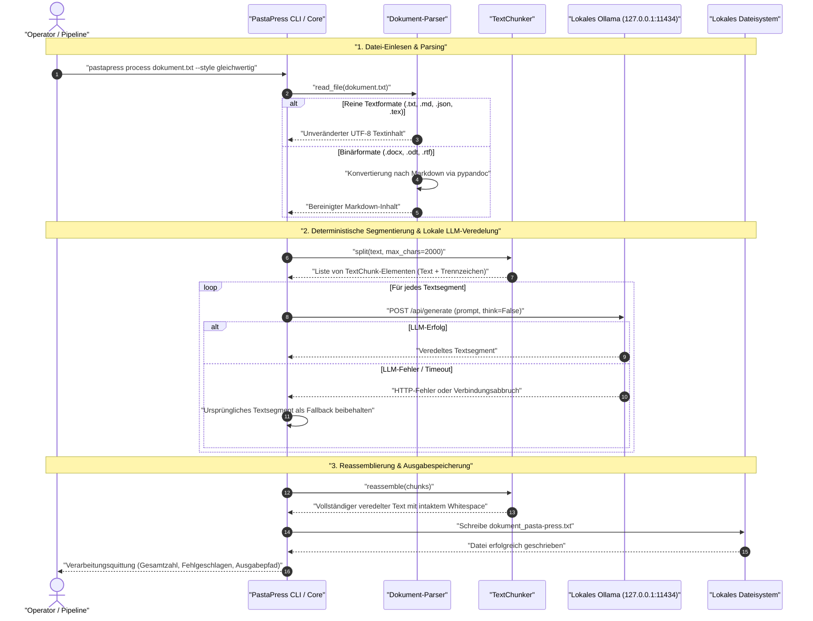

<p align="center">
  
</p>

# PastaPress

**English version** · **[English](README.md)** · **Deutsch**

> Deterministische Textveredelung, Paraphrasierung und Übersetzung über lokale Ollama-Instanzen mit exakter Segmentgrenzen-Erhaltung und ohne externen Datenabfluss.

<p align="center">
  <a href="https://www.python.org/downloads/"></a>
  <a href="LICENSE"></a>
  <a href="CHANGELOG.md"></a>
  <a href=".github/workflows/ci.yml"></a>
  <a href="tests/"></a>
  <a href="SECURITY.md"></a>
  <a href="SECURITY.md"></a>
  <a href="SECURITY.md"></a>
  <a href="SECURITY.md"></a>
  <a href="https://github.com/ellmos-ai"></a>
  <a href="https://github.com/open-bricks"></a>
  <a href="llms.txt"></a>
</p>

> [!NOTE]
> **KI-Agenten & LLM-Kontext**: Vollständige maschinenlesbare Spezifikationen und RAG-Suchbegriffe sind in [`llms.txt`](llms.txt) hinterlegt. PastaPress arbeitet zu 100 % lokal gegen angebundene Ollama-Instanzen (`localhost:11434` oder lokales Netzwerk). Absatzbegrenzer und Rand-Whitespaces bleiben exakt gewahrt bei dynamischer Stilsteuerung und garantiertem Zero-Data-Egress.

## Navigation

- [Systemarchitektur](#systemarchitektur)
- [Verarbeitungs-Lebenszyklus](#verarbeitungs-lebenszyklus)
- [Governance- & Laufzeit-Invarianten](#governance-und-laufzeit-invarianten)
- [Zielgruppen-Personas & SEO](#zielgruppen-personas-und-seo)
- [Architektur- & Funktionsvergleich](#vergleichsmatrix)
- [Einsatzzwecke](#einsatzzwecke)
- [Funktionen](#funktionen)
- [Installation](#installation)
- [Konfiguration](#konfiguration)
- [Nutzung](#nutzung)
- [Datenschutz & Sicherheit](#datenschutz-und-sicherheit)
- [Geschwister-Ökosystem](#geschwister-oekosystem)
- [Verifikation](#verifikation)
- [Lizenz & Herkunft](#lizenz-und-herkunft)

---

<a id="systemarchitektur"></a>
<a id="system-architecture"></a>
## Systemarchitektur



---

<a id="verarbeitungs-lebenszyklus"></a>
<a id="processing-lifecycle"></a>
## Verarbeitungs-Lebenszyklus

Das nachfolgende Sequenzdiagramm illustriert den gesamten Ablauf von der Formaterkennung und deterministischen Absatz-Segmentierung über die beschleunigte lokale LLM-Veredelung (`disable_thinking`) bis zur trennzeichengetreuen Zusammenfügung.



---

<a id="governance-und-laufzeit-invarianten"></a>
<a id="governance-and-runtime-invariants"></a>
## Governance- & Laufzeit-Invarianten

PastaPress unterliegt 10 strikten Architektur- und Governance-Invarianten, die bei jedem Release automatisiert überprüft werden:

| # | Invariante | Beschreibung | Verifikation & Durchsetzung |
|---|---|---|---|
| 1 | **INV-LOCAL-01 (Zero External Egress)** | 100 % lokale oder LAN-Ausführung gegen Ollama (`localhost:11434`); keinerlei Cloud-Tracking. | Host-Bindungsvalidierung & Testsuite |
| 2 | **INV-LOCAL-02 (RunAsInvoker-Sicherheit)** | Läuft unprivilegiert im Benutzerbereich; erfordert keinerlei Administrator-Rechte. | Benutzermodus-Tests & [SECURITY.md](SECURITY.md) |
| 3 | **INV-LOCAL-03 (Permissive Lizenzierung)** | Saubere MIT-Lizenz; keine Copyleft-Infektion; getrennte Subprozess-Isolation für Pandoc. | [THIRD_PARTY_LICENSES.md](THIRD_PARTY_LICENSES.md) |
| 4 | **INV-LOCAL-04 (Deterministische Reassemblierung)** | Exakte Erhaltung doppelter Zeilenumbrüche und Whitespaces zwischen Absätzen. | `tests/test_chunker.py` Roundtrip-Suite |
| 5 | **INV-LOCAL-05 (Transparenter Fallback)** | Fehlgeschlagene Chunks fallen sicher auf den Originaltext zurück; Quittung zählt Fehler. | `tests/test_core.py` Fehlertests |
| 6 | **INV-LOCAL-06 (Ehrliche KI-Transparenz)** | Generative Paraphrasierung; keine falschen Wasserzeichen-Immunitätsversprechen. | Vertragstests & [MARKETING-LOG.txt](MARKETING-LOG.txt) |
| 7 | **INV-LOCAL-07 (Multi-Host-Sync-Schutz)** | Repository ignoriert Multi-Host-Konfliktkopien, Synchronisations-Duplikate und Sperrdateien. | `tests/test_repository_hygiene.py` Gitignore-Check |
| 8 | **INV-LOCAL-08 (PEP 621 Standard)** | Standardisierte deklarative Paketkonfiguration in `pyproject.toml` mit CLI-Einstiegspunkt. | `tests/test_repository_hygiene.py` Metadaten-Check |
| 9 | **INV-LOCAL-09 (Versionsparität)** | Einheitliche Version (1.2.2) über Paket, Manifeste, Changelog und Dokumentation. | `tests/test_repository_hygiene.py` Paritäts-Prüfung |
| 10 | **INV-LOCAL-10 (48h Sicherheits-SLA)** | Verbindlich dokumentierte 48-Stunden-Reaktions- und Einstufungszeit bei Sicherheitsmeldungen. | [SECURITY.md](SECURITY.md) Richtlinie |

---

<a id="zielgruppen-personas-und-seo"></a>
<a id="target-personas-and-seo"></a>
## Zielgruppen-Personas & SEO

PastaPress richtet sich an Entwickler, Autoren und automatisierte Systeme mit hohen Anforderungen an Datenschutz, Segmenterhaltung und stilistische Veredelung:

- **`[PERSONA-01]` Lokale LLM- & Ollama-Power-User**: Anwender mit eigener Hardware (Apple Silicon Mac Studio, Linux/Windows GPU-Workstations), die kostenfreie, schnelle Textveredelung verlangen und durch `disable_thinking` 10-80-fache Geschwindigkeitsgewinne erzielen.
- **`[PERSONA-02]` Technische Autoren, Forscher & Übersetzer**: Verfasser von Fachaufsätzen oder Übersetzungen, die Entwürfe verfeinern (`wissenschaftlich`, `gleichwertig`), während Markdown-Strukturen und Tabellen intakt bleiben.
- **`[PERSONA-03]` Datenschutzbewusste Unternehmen & Organisationen**: Rechts-, Compliance- und Firmenteams mit vertraulichen internen Dokumenten (Berichte, Memos), für die externer Datenabfluss ausgeschlossen sein muss.
- **`[PERSONA-04]` Autonome Multi-Agenten- & Pipeline-Architekten**: Software-Ingenieure, die programmatische Textpolitur via `PastaPressCore` und Batch-Warteschlangen (`queue.json`) in Workflows integrieren.

#### Suchbegriffe mit hoher Relevanz (SEO)
- `lokale textveredelung ollama`, `deterministisches markdown chunking`, `datenschutz text paraphrasierung`, `mac studio ollama text polish`, `disable thinking beschleunigung qwen`, `lokales llm uebersetzungstool`, `batch dokumenten veredelung`, `zero egress text processing`, `ellmos-ai pastapress`.

---

<a id="vergleichsmatrix"></a>
<a id="comparison-matrix"></a>
## Architektur- & Funktionsvergleich

Vergleich von `pasta-press` mit alternativen Paraphrasierungs- und Veredelungslösungen:

| Dimension / Fähigkeit | Cloud-Paraphraser (QuillBot/Grammarly) | Einfaches Ollama-Skript | Schwere Agenten-Frameworks | pasta-press |
|:---|:---:|:---:|:---:|:---:|
| **1. Datenschutz & Zero Egress** | Cloud-abhängig (PII-Abflussrisiko) | Lokal | Oft cloud-lastig | **Zero Egress (100 % lokal)** |
| **2. Segmentgrenzen-Integrität** | Blackbox / Beschnitten | Verloren / Beschnitten | Komplex / Variabel | **Deterministisch & verlustfreie Trenner** |
| **3. Thinking-Token-Optimierung** | Nicht zutreffend | Fehlt (hohe Latenz bei R1/Qwen) | Selten integriert | **Standard `disable_thinking` (~80x schneller)** |
| **4. Dokumentenformat-Breite** | Copy-Paste / Nur Text | Nur Plaintext | Benötigt viele Plugins | **Reiner Text + Pandoc (.docx, .odt, .rtf)** |
| **5. Open-Source-Lizenzierung** | Proprietäres Abonnement | Variabel | Komplexe Lizenzen | **MIT (100 % permissiv)** |
| **6. Batch- & Queue-Architektur** | Nur im Bezahlmodell | Fehlt | Hoher Overhead | **Eingebaute `queue.json` Warteschlange** |
| **7. Fehler-Resilienz bei Chunks** | Lautloser Datenverlust | Programmabbruch | Versteckte Retries | **Original-Fallback + Chunk-Fehlerquittung** |
| **8. Privilegien-Sicherheit** | Cloud / Web-Dienst | Benutzermodus | Häufig Docker / Root | **Strikter `RunAsInvoker`-Modus** |
| **9. Multi-Host-Sync-Schutz** | Nicht zutreffend | Keine | Keine | **Gegen Sync-Konflikte gehärtetes Gitignore** |
| **10. 48h Sicherheits-SLA** | Hersteller-SLA | Keine | Community | **Verbindlich in SECURITY.md zugesichert** |

---

<a id="einsatzzwecke"></a>
<a id="use-cases"></a>
## 💡 Einsatzzwecke

- **Abschwächung statistischer Text-Wasserzeichen durch gleichwertige Paraphrasierung — bei transparenter KI-Offenlegung.** Der Standardstil `gleichwertig` formuliert auf einem vergleichbaren semantischen, informativen und sprachlichen Niveau um. Dadurch können statistische Häufungen typischer KI-Phrasen reduziert werden. PastaPress ist kein Detektor und garantiert weder vollständigen Informationserhalt noch die vollständige Tilgung aller Signale. Verwender sind verpflichtet, KI-Beteiligung transparent zu deklarieren (z. B. in wissenschaftlichen Arbeiten).
- **Entwürfe und Notizen in flüssige Prosa überführen** — Rohfassungen und Stichpunkte werden sprachlich geglättet, während die Prompts das Modell anweisen, Struktur und Inhalt möglichst vollständig zu bewahren.
- **Übersetzen mit Strukturerhalt** — PastaPress bewahrt technische Trennzeichen, während das Modell angewiesen wird, Markdown-Formatierungen und Aufzählungen beizubehalten.
- **Ganze Ordner im Batch verarbeiten** — Verzeichnisse einreihen, sequentiell abarbeiten lassen, Originale bleiben unverändert erhalten.

PastaPress durchsucht oder entfernt **keine** unsichtbaren Unicode-Zeichen,
eingebettete Signaturstrings, C2PA-Zertifikate, EXIF/XMP-Felder oder sonstige Metadaten.
LLM-Paraphrasierung ist generativ; kritische Ergebnisse sind stets manuell
abzugleichen. Gesetzliche Kennzeichnungspflichten bleiben unberührt.

---

<a id="funktionen"></a>
<a id="features"></a>
## 🌟 Funktionen

- **Chunk-basierte Verarbeitung:** Verarbeitet Textdateien absatzweise, um Kontextbegrenzungen zu umgehen. Übergroße Absätze werden an Zeilen- und Wortgrenzen weiter unterteilt.
- **Deterministische Reassemblierung:** Fügt ursprüngliche Zeilenumbrüche und Whitespaces zwischen Absätzen exakt wieder zusammen. (Inhalte innerhalb eines Chunks können generativ variieren).
- **Formatunterstützung:** Unterstützt `.txt`, `.md`, `.json`, `.csv`, `.yaml`, `.tex` sowie automatische Konvertierung von Binärformaten wie `.docx`, `.odt` und `.rtf` via `pypandoc`. (Altes Binär-`.doc` wird nicht unterstützt — bitte vorher in `.docx` konvertieren).
- **Stilsteuerung:** Stile flexibel anpassbar (`gleichwertig`, `wissenschaftlich`, `einfach`, `kurz` oder `original`).
- **Übersetzungsmodus:** Übersetzt Texte on-the-fly in beliebige Zielsprachen.
- **Warteschlangensystem:** Verarbeitet Ordner strukturiert über `queue.json`.

---

<a id="installation"></a>
## 🚀 Installation

Voraussetzung ist Python 3.10+ (Python 3.12+ empfohlen).

```bash
git clone https://github.com/ellmos-ai/pasta-press.git
cd pasta-press
pip install -e .
```

Optionale Pandoc-Brücke für Binärdokumente (`.docx`, `.odt`, `.rtf`):

```bash
pip install -e .[pandoc]
```

---

<a id="konfiguration"></a>
<a id="configuration"></a>
## ⚙️ Konfiguration

Konfiguriere deinen lokalen Ollama-Host und das Standardmodell (Standard: `http://localhost:11434`; Einstellungen liegen in der lokalen, nicht versionierten `config.json` — siehe `config.example.json`):

```bash
pastapress config --auto  # Erkennt automatisch das geeignetste Modell
# ODER
pastapress config --model qwen3.6:35b-mlx --host http://mein-server:11434
```

Standardstil und Übersetzung einstellen:

```bash
pastapress config --style wissenschaftlich
pastapress config --translate-mode on --lang "Spanisch"
```

Reasoning/Thinking-Tokens sind standardmäßig deaktiviert (~10-80x schneller bei Modellen wie qwen3.x; bei kleineren Modellen kann dies sprachliche Feinheiten kosten). Bei Bedarf reaktivieren:

```bash
pastapress config --thinking on
```

---

<a id="nutzung"></a>
<a id="usage"></a>
## 🛠️ Nutzung

### Einzelne Datei verarbeiten
```bash
pastapress process mein_dokument.txt
```
*Die Ausgabe wird standardmäßig als `mein_dokument_pasta-press.txt` gespeichert.*

### Stil und Sprache situativ überschreiben
```bash
pastapress process entwurf.docx --style original --translate English
```

### Gesamten Ordner verarbeiten (Batch / Queue)
```bash
pastapress process ./mein_ordner
pastapress process-queue
```

### Direkten Text verarbeiten (Agenten- / Pipeline-Integration)
```bash
pastapress text "Dies ist ein Rohentwurf, der stilistisch aufgewertet werden soll."
```

---

<a id="datenschutz-und-sicherheit"></a>
<a id="privacy-and-data-security"></a>
## 🔒 Datenschutz & Sicherheit

- **Lokale Verarbeitung:** Alle Daten verbleiben vollständig auf der lokalen Maschine bzw. dem konfigurierten LAN-Host (`http://localhost:11434`).
- **Keine Telemetrie:** Keine Weiterleitung an Cloud-Dienste oder externe Analyse-Endpunkte.
- **Filterung:** Geplante Tag- und Code-Filter (siehe `ROADMAP.md`), um sensible Quellcode-Teile gezielt von LLM-Aufrufen auszunehmen.
- **Rechte-Begrenzung:** Läuft strikt unprivilegiert als regulärer Benutzerprozess (`RunAsInvoker`).

---

<a id="geschwister-oekosystem"></a>
<a id="sibling-ecosystem"></a>
## 🌐 Geschwister-Ökosystem

PastaPress ist Teil des Ökosystems von **ellmos-ai** und **open-bricks**:

- **[ellmos-codecommander-mcp](https://github.com/ellmos-ai/ellmos-codecommander-mcp)**: MCP-Code-Analyse, AST-Prüfung und strukturelle Code-Transformation.
- **[n8n-workflow-manager](https://github.com/ellmos-ai/n8n-workflow-manager)**: Visueller Workflow-Graph-Viewer, SQLite-Entscheidungsaudit und Multi-Server-Sync für n8n.
- **[decision-clicker](https://github.com/ellmos-ai/decision-clicker)**: Interaktives CLI-Entscheidungstracking und Mandanten-Management.
- **[prompt-listener](https://github.com/ellmos-ai/prompt-listener)**: Lokale Prompt-Warteschlange und automatisierter Agenten-Ausführungsdienst.
- **[open-bricks](https://github.com/open-bricks)**: Offene Dachorganisation für modulare Entwicklerwerkzeuge.

---

<a id="verifikation"></a>
<a id="verification"></a>
## 🧪 Verifikation & Qualitätsprüfung

```bash
# Automatisierte Pytest-Suite ausführen
pytest -ra -v

# Code-Prüfung mit ruff
ruff check .

# Mermaid-Diagramm-Syntax validieren
python pfad/zu/_tools/lint_mermaid.py .

# Python-Bytecode kompilieren
python -m compileall -q pastapress tests docs
```

---

<a id="lizenz-und-herkunft"></a>
<a id="license-and-provenance"></a>
## 📄 Lizenz & Herkunft

MIT-Lizenz — gilt für Quellcode, Prompts und Dokumentation in diesem Repository (siehe [`LICENSE`](LICENSE)).

Drittanbieter-Abhängigkeiten und Subprozess-Lizenzen sind in [`THIRD_PARTY_LICENSES.md`](THIRD_PARTY_LICENSES.md) dokumentiert.

### Gesetzlicher Hinweis (§ 521 BGB Gefälligkeitsrecht)
Dieses Repository und die darin enthaltenen Werkzeuge werden unentgeltlich und als Open-Source-Software zur Verfügung gestellt. Gemäß § 521 BGB ist die Haftung auf Vorsatz und grobe Fahrlässigkeit beschränkt. Die Nutzung erfolgt auf eigenes Risiko im Rahmen der MIT-Lizenz.

Dieses Werkzeug entstand KI-gestützt innerhalb des ellmos-ai Ökosystems und wird durch menschliche Reviews gepflegt. Siehe `docs/ai-act-note.md` zur Einordnung unter dem EU AI Act.
