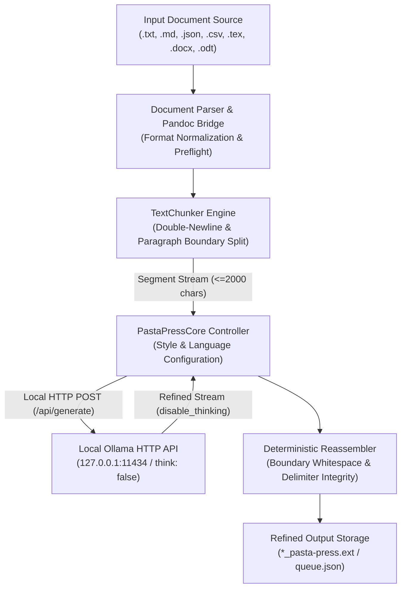
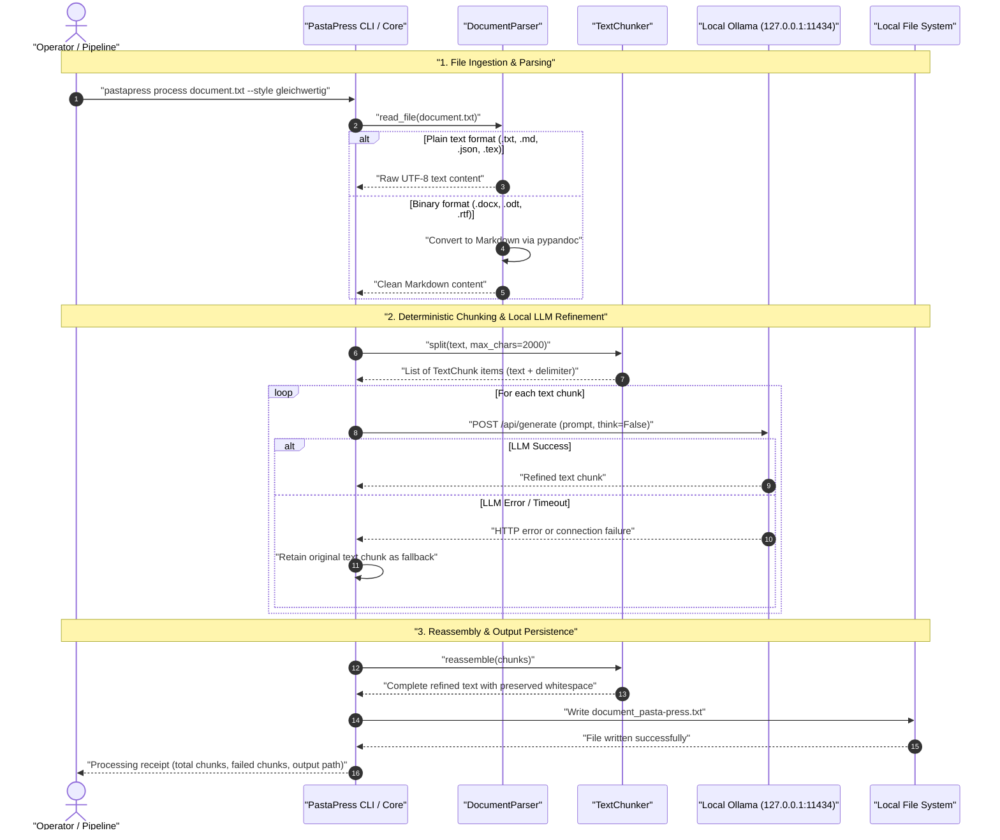

<p align="center">
  
</p>

# PastaPress

**[Deutsche Version](README.de.md)** · **English**

> Deterministic text refinement, paraphrasing, and translation via local Ollama instances with chunk boundary preservation and zero external data egress.

<p align="center">
  <a href="https://www.python.org/downloads/"></a>
  <a href="LICENSE"></a>
  <a href="CHANGELOG.md"></a>
  <a href=".github/workflows/ci.yml"></a>
  <a href="tests/"></a>
  <a href="SECURITY.md"></a>
  <a href="SECURITY.md"></a>
  <a href="SECURITY.md"></a>
  <a href="SECURITY.md"></a>
  <a href="https://github.com/ellmos-ai"></a>
  <a href="https://github.com/open-bricks"></a>
  <a href="llms.txt"></a>
</p>

> [!NOTE]
> **AI Agent & LLM Context**: Full machine-readable specification and RAG context phrases are indexed in [`llms.txt`](llms.txt). PastaPress operates 100% locally against Ollama instances (`localhost:11434` or local network LAN). It preserves paragraph chunk delimiters and boundary whitespace while offering dynamic style modulation and zero external cloud egress.

## Navigation

- [System Architecture](#system-architecture)
- [Processing Lifecycle](#processing-lifecycle)
- [Governance & Runtime Invariants](#governance-and-runtime-invariants)
- [Target Audience Personas & SEO](#target-personas-and-seo)
- [Architecture & Feature Comparison](#comparison-matrix)
- [Use Cases](#use-cases)
- [Features](#features)
- [Installation](#installation)
- [Configuration](#configuration)
- [Usage](#usage)
- [Privacy & Data Security](#privacy-and-data-security)
- [Sibling Ecosystem](#sibling-ecosystem)
- [Verification](#verification)
- [License & Provenance](#license-and-provenance)

---

<a id="system-architecture"></a>
## System Architecture



---

<a id="processing-lifecycle"></a>
## Processing Lifecycle

The sequence below illustrates the end-to-end processing pipeline from initial format detection and deterministic paragraph chunking through local LLM refinement with `disable_thinking` acceleration to exact delimiter reassembly.



---

<a id="governance-and-runtime-invariants"></a>
## Governance & Runtime Invariants

PastaPress adheres to 10 strict architectural and governance invariants verified across all releases:

| # | Invariant | Description | Verification & Enforcement |
|---|---|---|---|
| 1 | **INV-LOCAL-01 (Zero External Egress)** | 100% local or private LAN execution against Ollama (`localhost:11434`); zero cloud tracking. | Host binding validation & test suite |
| 2 | **INV-LOCAL-02 (RunAsInvoker Security)** | Runs unprivileged in user space; requires zero administrative elevation. | User-space isolation tests & [SECURITY.md](SECURITY.md) |
| 3 | **INV-LOCAL-03 (Permissive Licensing)** | Clean MIT licensing; zero copyleft infection; independent sub-process isolation for Pandoc. | [THIRD_PARTY_LICENSES.md](THIRD_PARTY_LICENSES.md) |
| 4 | **INV-LOCAL-04 (Deterministic Reassembly)** | Preserves exact double-newlines and boundary whitespace between chunks. | `tests/test_chunker.py` roundtrip suite |
| 5 | **INV-LOCAL-05 (Transparent Fallback)** | Failed LLM chunks gracefully fallback to original text; chunk metrics reported. | `tests/test_core.py` error counting tests |
| 6 | **INV-LOCAL-06 (Honest AI Disclosure)** | Paraphrasing is generative; no false watermark claims; disclosure requirements upheld. | Contract tests & [MARKETING-LOG.txt](MARKETING-LOG.txt) |
| 7 | **INV-LOCAL-07 (Multi-Host Sync Safe)** | Repository ignores multi-host conflict files, sync duplicates, and system locks. | `tests/test_repository_hygiene.py` gitignore checks |
| 8 | **INV-LOCAL-08 (PEP 621 Standardized)** | Standard declarative packaging in `pyproject.toml` with `pastapress` console script. | `tests/test_repository_hygiene.py` metadata checks |
| 9 | **INV-LOCAL-09 (Manifest Parity)** | Unified version numbering across package, manifests, changelog, and documentation. | `tests/test_repository_hygiene.py` parity check |
| 10 | **INV-LOCAL-10 (48h Security SLA)** | Formally committed 48-hour response and triage SLA for reported security issues. | [SECURITY.md](SECURITY.md) policy gate |

---

<a id="target-personas-and-seo"></a>
## Target Audience Personas & SEO

PastaPress is designed for users and systems that require local-first privacy, deterministic boundary retention, and reliable stylistic polishing:

- **`[PERSONA-01]` Local LLM & Ollama Power Users**: Operators with local hardware (Apple Silicon Mac Studio, Linux/Windows GPU rigs) who require zero-cost, high-speed document refinement and benefit from 10-80x speedups via `disable_thinking`.
- **`[PERSONA-02]` Technical Writers, Researchers & Translators**: Authors translating drafts or elevating notes into publication-grade prose who rely on stylistic presets (`wissenschaftlich`, `gleichwertig`) while preserving Markdown structure.
- **`[PERSONA-03]` Privacy-Conscious Organizations & Enterprise Authors**: Legal, compliance, and enterprise teams handling sensitive internal documents (reports, memos, briefs) requiring guaranteed Zero External Network Egress.
- **`[PERSONA-04]` Autonomous Multi-Agent & Pipeline Architects**: Engineers embedding programmatic text polishing into agent pipelines via `PastaPressCore` and batch queueing (`queue.json`).

#### High-Intent Discoverability & Search Keywords
- `local text refinement ollama`, `deterministic markdown chunking`, `privacy-first text paraphrasing`, `mac studio ollama text polish`, `disable thinking reasoning token speedup`, `local llm translation tool`, `batch document text refiner`, `zero egress text processing`, `ellmos-ai pastapress`.

---

<a id="comparison-matrix"></a>
## Architecture & Feature Comparison

Comparison of `pasta-press` with alternative paraphrasing and text-refinement workflows:

| Dimension / Capability | Cloud Paraphrasers (QuillBot/Grammarly) | Naive Ollama Script | Heavy Agent Frameworks | pasta-press |
|:---|:---:|:---:|:---:|:---:|
| **1. Data Privacy & Egress** | Cloud-dependent (PII leak risk) | Local | Often cloud-biased | **Zero Egress (100% Local)** |
| **2. Chunk Boundary Integrity** | Blackbox / Truncated | Lost / Truncated | Complex / Variable | **Deterministic & lossless delimiters** |
| **3. Thinking Token Optimization** | N/A | Missing (high latency on R1/Qwen) | Selten integriert | **Default `disable_thinking` (~80x speedup)** |
| **4. Document Format Breadth** | Copy-paste / Text only | Plain text only | Requires heavy plugins | **Native Text + Pandoc (.docx, .odt, .rtf)** |
| **5. Open Source Licensing** | Proprietary subscription | Variable | Complex licenses | **MIT (100% Permissive)** |
| **6. Batch & Queue Architecture** | Paid tier only | Missing | Heavy overhead | **Built-in `queue.json` batch mode** |
| **7. Partial Failure Resilience** | Silent loss | Process crash | Hidden retries | **Original fallback + chunk metric receipt** |
| **8. Non-Elevation Security** | Cloud / Web only | User space | Often Docker / Root | **Strict `RunAsInvoker` mode** |
| **9. Multi-Host Sync Guardrails** | N/A | None | None | **Gitignore hardened against sync conflicts** |
| **10. 48-Hour Coordinated SLA** | Vendor SLA | None | Community | **Committed in SECURITY.md** |

---

<a id="use-cases"></a>
## 💡 Use Cases

- **Reduce statistical text-watermark signals through comparable-level paraphrasing — while keeping AI disclosure.** The default `gleichwertig` style rewrites wording at a comparable semantic, informational, and linguistic level. This can reduce statistical patterns in token and phrasing choices; it is not a detector and does not guarantee that every detail is retained or every statistical signal is removed. Declare actual AI involvement wherever disclosure is expected, e.g. in a scientific article.
- **Polish raw notes into readable prose** — meeting notes, drafts, and quick dumps come out more fluent while the prompt asks the model to retain their information and structure as fully as possible.
- **Translate while retaining structure where possible** — PastaPress preserves technical chunk boundaries, while the model is instructed to retain Markdown and lists inside translated text.
- **Batch-press whole folders** — queue a directory, let it run, keep the originals.

PastaPress does **not** scan for or remove literal or invisible Unicode signs,
embedded marker strings, C2PA data, EXIF/XMP fields, or other file/container
metadata. LLM paraphrasing is generative, so important output must be reviewed
against the source. AI-disclosure requirements remain unaffected.

---

<a id="features"></a>
## 🌟 Features

- **Chunk-based Processing:** Processes text files paragraph by paragraph to bypass LLM context limits. Oversized paragraphs are split further at line and word boundaries.
- **Deterministic Chunk Reconstruction:** Reassembles the original delimiters between chunks and their boundary whitespace exactly. Model-generated text inside a chunk can still change facts or formatting; this is not a lossless-content guarantee.
- **Format Support:** Supports `.txt`, `.md`, `.json`, `.csv`, `.yaml`, `.tex`, and auto-converts binary formats like `.docx`, `.odt`, and `.rtf` to clean Markdown using `pypandoc`. (Legacy binary `.doc` is not supported — convert it to `.docx` first.)
- **Stylistic Control:** Dynamically adapt the refinement style (`gleichwertig`, `wissenschaftlich`, `einfach`, `kurz`, or `original`). The default `gleichwertig` style targets comparable meaning, information, and language level while varying phrasing.
- **Translation Mode:** Optionally translate text into any target language on-the-fly while asking the model to retain formatting where possible.
- **Queue System:** Batch-process entire directories sequentially via `queue.json`.

---

<a id="installation"></a>
## 🚀 Installation

Ensure you have Python 3.10+ installed (Python 3.12+ recommended).

```bash
git clone https://github.com/ellmos-ai/pasta-press.git
cd pasta-press
pip install -e .
```

Optional pandoc bridge for processing binary `.docx`, `.odt`, and `.rtf` documents:

```bash
pip install -e .[pandoc]
```

---

<a id="configuration"></a>
## ⚙️ Configuration

Configure your local Ollama host and default model (defaults to `http://localhost:11434`; settings are stored in a local, untracked `config.json` — see `config.example.json`):

```bash
pastapress config --auto  # Auto-detects the best model on your host
# OR
pastapress config --model qwen3.6:35b-mlx --host http://my-ollama-server:11434
```

Set your preferred default style and translation settings:

```bash
pastapress config --style wissenschaftlich
pastapress config --translate-mode on --lang "Spanish"
```

Model thinking/reasoning is disabled by default (~10-80x faster on thinking-capable models like qwen3.x; project tests found rougher phrasing on small models, while no complete information-retention guarantee is made). Re-enable it if you prefer maximum polish over speed:

```bash
pastapress config --thinking on
```

---

<a id="usage"></a>
## 🛠️ Usage

### Process a Single File
```bash
pastapress process my_document.txt
```
*Output will be saved as `my_document_pasta-press.txt` by default.*

### Override Styles and Languages per File
```bash
pastapress process draft.docx --style original --translate English
```

### Process a Directory (Batch / Queue)
```bash
pastapress process ./my_folder
pastapress process-queue
```

### Process Raw Text (Agent / Pipeline Integration)
```bash
pastapress text "This is a raw draft text that needs stylistic refinement."
```

---

<a id="privacy-and-data-security"></a>
## 🔒 Privacy & Data Security

- **Local Processing:** All data is processed completely locally via the configured Ollama host (default: `http://localhost:11434`).
- **No Telemetry:** No data is sent to external clouds or third-party APIs.
- **Smart Filtering:** (Planned - see `ROADMAP.md`) Future versions will offer strict tag/code filtering to prevent sensitive code chunks from being sent to the LLM.
- **Non-Elevation:** Runs exclusively as an unprivileged process conforming to `RunAsInvoker`.

---

<a id="sibling-ecosystem"></a>
## 🌐 Sibling Ecosystem

PastaPress is part of the **ellmos-ai** and **open-bricks** ecosystem:

- **[ellmos-codecommander-mcp](https://github.com/ellmos-ai/ellmos-codecommander-mcp)**: MCP code analysis, AST inspection, and structural editing.
- **[n8n-workflow-manager](https://github.com/ellmos-ai/n8n-workflow-manager)**: Visual workflow graph viewer, SQLite decision audit, and multi-server sync for n8n.
- **[decision-clicker](https://github.com/ellmos-ai/decision-clicker)**: Interactive CLI decision tracking and intake management.
- **[prompt-listener](https://github.com/ellmos-ai/prompt-listener)**: Local prompt queueing and automated agent execution service.
- **[open-bricks](https://github.com/open-bricks)**: Open umbrella ecosystem for developer productivity modules.

---

<a id="verification"></a>
## 🧪 Verification & Quality Gate

```bash
# Run automated pytest suite
pytest -ra -v

# Lint code with ruff
ruff check .

# Validate Mermaid diagram syntax
python path/to/_tools/lint_mermaid.py .

# Compile Python byte code
python -m compileall -q pastapress tests docs
```

---

<a id="license-and-provenance"></a>
## 📄 License & Provenance

MIT License — covers the code, prompts, and documentation in this repository (see [`LICENSE`](LICENSE)).

Third-party dependencies and sub-process licenses are detailed in [`THIRD_PARTY_LICENSES.md`](THIRD_PARTY_LICENSES.md).

This tool was developed AI-assisted within the ellmos-ai ecosystem and is maintained with human review. See `docs/ai-act-note.md` for scope and intended use under the EU AI Act.
