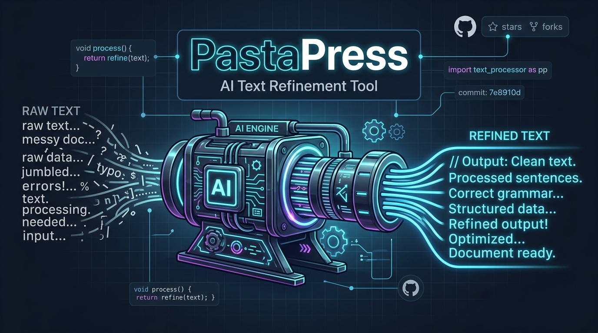

<p align="center">
  
</p>

# PastaPress

**PastaPress** is a powerful command-line tool and Python module designed for stylistic text refinement via a local Ollama instance (e.g., Mac Studio). It pushes raw, messy text through an AI "press" and returns refined, smooth text without altering the core facts or structural integrity.

*Read this documentation in [German (Deutsch)](README.de.md).*

## 🌟 Features
- **Chunk-based Processing:** Processes text files paragraph by paragraph to bypass LLM context limits.
- **Flawless Reconstruction:** Keeps delimiters and original markdown formatting completely intact.
- **Format Support:** Supports `.txt`, `.md`, `.json`, `.csv`, `.yaml`, `.tex`, and auto-converts binary formats like `.docx`, `.odt`, `.rtf`, and `.doc` to clean Markdown using `pypandoc`.
- **Stylistic Control:** Dynamically adapt the refinement style (`gleichwertig`, `wissenschaftlich`, `einfach`, `kurz`, or `original`).
- **Translation Mode:** Optionally translate text into any target language on-the-fly while preserving format.
- **Queue System:** Batch-process entire directories sequentially via `queue.json`.

## 🚀 Installation

Ensure you have Python 3.12+ installed.

```bash
git clone https://github.com/ellmos-ai/pasta-press.git
cd pasta-press
pip install -r requirements.txt
```
*(Note: If you plan to process `.docx` or `.odt` files, the tool will attempt to download Pandoc automatically if it is missing.)*

## ⚙️ Configuration

Configure your local Ollama host and default model:
```bash
python -m pastapress config --auto  # Auto-detects the best model on your host
# OR
python -m pastapress config --model qwen3.6:35b-mlx --host http://localhost:11434
```

Set your preferred default style and translation settings:
```bash
python -m pastapress config --style wissenschaftlich
python -m pastapress config --translate-mode on --lang "Spanish"
```

## 🛠️ Usage

### Process a Single File
```bash
python -m pastapress process my_document.txt
```
*Output will be saved as `my_document_pasta-press.txt` by default.*

### Override Styles and Languages per File
```bash
python -m pastapress process draft.docx --style original --translate English
```

### Process a Directory (Batch / Queue)
```bash
python -m pastapress process ./my_folder
python -m pastapress process-queue
```

### Process Raw Text (Integration)
```bash
python -m pastapress text "This is a very bad text that needs fixing."
```

## 🔒 Privacy & Data Security
- **Local Processing:** All data is processed completely locally via the configured Ollama host (default: `http://localhost:11434`).
- **No Telemetry:** No data is sent to external clouds or third-party APIs.
- **Smart Filtering:** (Planned - see `ROADMAP.md`) Future versions will offer strict tag/code filtering to prevent sensitive code chunks from being sent to the LLM.
